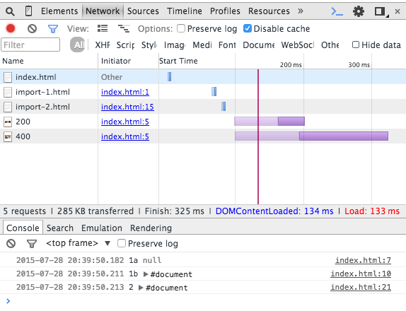

# test-html-import

## Uwagi

 * Atrybut `async` dodany do `<link>` informuje, że plik nie będzie renderowany od razu, tylko po załadowaniu całej strony. 
 **Na potwierdzenie na obrazku widzimy `null` w panelu `Console`.**
 
 * Jeśli w ściąganym pliku (poprzez `<link rel-"import">` dodamy znacznik `<template>` to jego zawartość nie będzie renderowana. 
 **Na potwierdzenie na obrazku widzimy, że ściągają się obrazki z końcówką `200` i `400` w adresie, a `100` i `300` już nie.** 
 